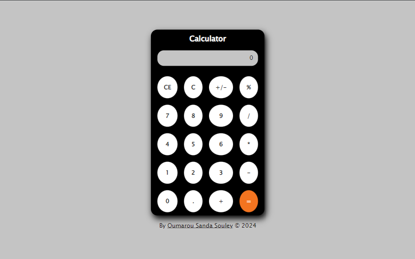

# Calculatrice en JavaScript

## Table des matières
- [Aperçu](#aperçu)
- [Fonctionnalités](#fonctionnalités)
- [Technologies](#technologies)
- [Installation](#installation)
- [Utilisation](#utilisation)
- [Structure du projet](#structure-du-projet)
- [Démo](#démo)
- [Contributions](#contributions)
- [Licence](#licence)

## Aperçu




Il s'agit d'une calculatrice simple et entièrement fonctionnelle construite à l'aide de HTML, CSS et JavaScript. Elle permet d'effectuer des opérations arithmétiques de base comme l'addition, la soustraction, la multiplication et la division. Ce projet fait partie d'une série de 40 projets de développement web visant à pratiquer et améliorer les compétences en développement we que vous trouverez ici: [40 Projets de développement web](https://www.github.com/OumarouSandaSouley/40-Projets-de-Developpemetn-Web.git)

## Fonctionnalités
- Opérations arithmétiques de base : addition, soustraction, multiplication et division.
- Bouton de réinitialisation pour effacer le calcul en cours.
- Design réactif : la calculatrice s'adapte à différentes tailles d'écran.

## Technologies
Ce projet utilise les technologies suivantes :
- **HTML5** : Structure de la calculatrice.
- **CSS3** : Style et mise en page de la calculatrice.
- **JavaScript** : Fonctionnalité principale pour réaliser les opérations arithmétiques.

## Installation
Pour exécuter ce projet en local, suivez ces étapes :

1. Clonez le dépôt :

   
2. Accédez au répertoire du projet :

   
3. Ouvrez le fichier `index.html` dans votre navigateur préféré :

   
Aucune installation ou dépendance supplémentaire n'est requise.

## Utilisation
1. Saisissez les chiffres à l'aide des boutons ou du clavier.
2. Sélectionnez une opération arithmétique (addition, soustraction, multiplication ou division).
3. Appuyez sur le bouton `=` pour afficher le résultat.
4. Utilisez le bouton `C` ou appuyez sur la touche `Échap` pour effacer l'entrée actuelle et commencer un nouveau calcul.

## Structure du projet
```
calculator-js/
│
├── index.html      # Fichier HTML principal
├── style.css       # Fichier CSS pour le style
└── script.js       # Fichier JavaScript pour la fonctionnalité
```

## Contributions
Les contributions sont les bienvenues ! Si vous souhaitez améliorer cette calculatrice ou ajouter de nouvelles fonctionnalités, n'hésitez pas à soumettre une pull request ou à ouvrir une issue.

1. Forkez le dépôt
2. Créez votre branche de fonctionnalité (`git checkout -b feature/ma-fonctionnalité`)
3. Validez vos modifications (`git commit -m 'Ajout de ma fonctionnalité'`)
4. Poussez sur la branche (`git push origin feature/ma-fonctionnalité`)
5. Ouvrez une pull request

## Licence
Ce projet est sous licence MIT. Consultez le fichier [LICENSE](LICENSE) pour plus de détails.
