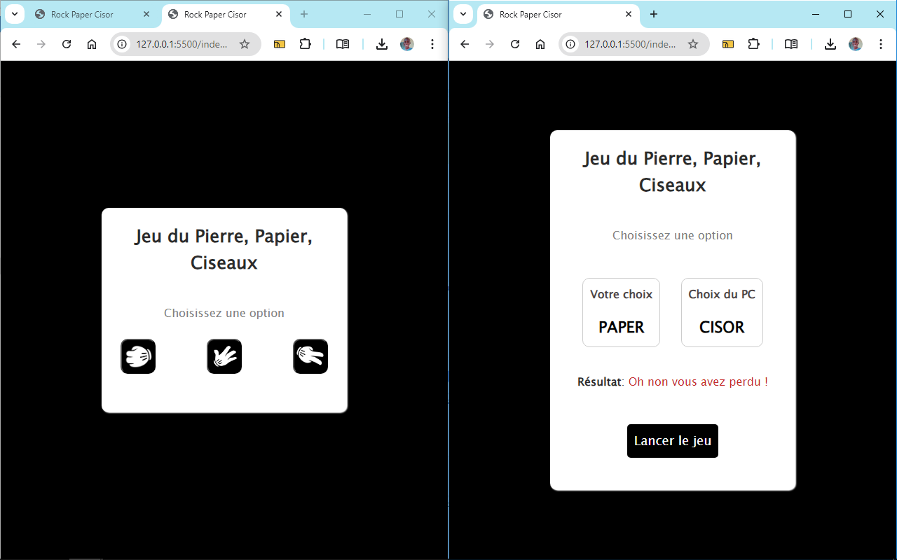

# Jeu du Pierre, Papier, Ciseaux en JavaScript

## Table des matières
- [Aperçu](#aperçu)
- [Fonctionnalités](#fonctionnalités)
- [Technologies](#technologies)
- [Installation](#installation)
- [Utilisation](#utilisation)
- [Structure du projet](#structure-du-projet)
- [Contributions](#contributions)
- [Licence](#licence)

## Aperçu




Il s'agit d'une implémentation du jeu classique Pierre, Papier, Ciseaux en JavaScript avec le fonctionnment et les régles connues. Vous jouez contre le PC. Ce projet fait partie d'une série de 40 projets de développement web visant à pratiquer et améliorer les compétences en développement web.

## Fonctionnalités
- Choix du jeton (Pierre, Papier ou Ciseaux)
- Vérification de votre choix avec celui du PC pour vérifier le gagnant
- Possibilité de jouer plusieurs fois
- Interface simple et minimaliste

## Technologies
Ce projet utilise les technologies suivantes :
- **HTML5** : Structure du jeu.
- **CSS3** : Style et mise en page du jeu.
- **JavaScript** : Fonctionnalité principale pour réaliser la logique du jeu

## Installation
Pour exécuter ce projet en local, suivez ces étapes :

1. Clonez le dépôt :

   
2. Accédez au répertoire du projet :

   
3. Ouvrez le fichier `index.html` dans votre navigateur préféré :

   
Aucune installation ou dépendance supplémentaire n'est requise.

## Utilisation
1. Une fois que vous lancez le fichier HTML dans votre navigateur, cliquez sur le Boutton `Lancer le Jeu`
2.  Choisissez votre Jeton entre Pierre, Papier ou Ciseaux et le programme se charge de vous livrer le résultat final entre vous et lui en évaluant biensure le résultat du jeu.
3. Relancez une autre partie en cliquant sur `Lancer le Jeu`

## Structure du projet
```
calculator-js/
│
├── index.html      # Fichier HTML principal
├── assets/style.css       # Fichier CSS pour le style
└── assets/script.js       # Fichier JavaScript pour la fonctionnalité
└── assets/img/       # Contient les images de Pierre, Papier et Ciseaux
```

## Contributions
Les contributions sont les bienvenues ! Si vous souhaitez améliorer ce Jeu ou ajouter de nouvelles fonctionnalités, n'hésitez pas à soumettre une pull request ou à ouvrir une issue.

1. Forkez le dépôt
2. Créez votre branche de fonctionnalité (`git checkout -b feature/ma-fonctionnalité`)
3. Validez vos modifications (`git commit -m 'Ajout de ma fonctionnalité'`)
4. Poussez sur la branche (`git push origin feature/ma-fonctionnalité`)
5. Ouvrez une pull request

## Licence
Ce projet est sous licence MIT. Consultez le fichier [LICENSE](LICENSE) pour plus de détails.
