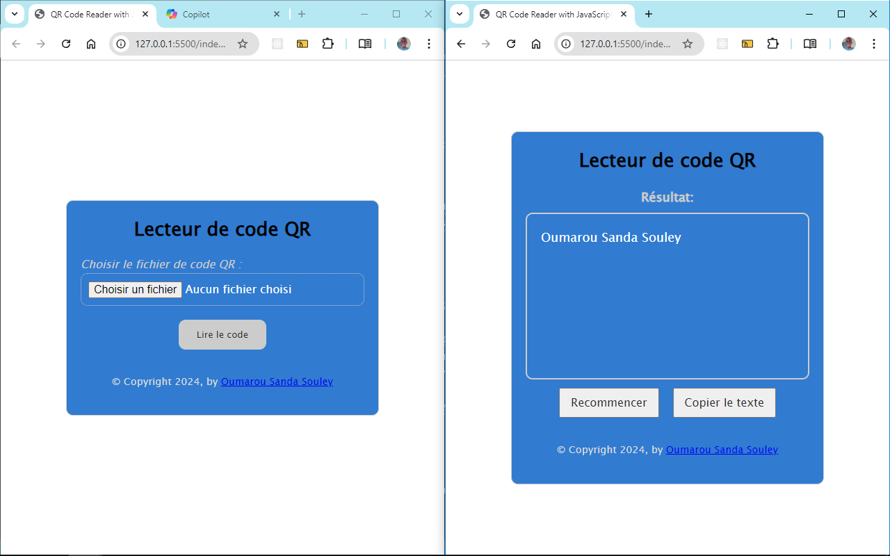

# Lecteur de code QR en JavaScript

## Table des matières
- [Aperçu](#aperçu)
- [Fonctionnalités](#fonctionnalités)
- [Technologies](#technologies)
- [Installation](#installation)
- [Utilisation](#utilisation)
- [Structure du projet](#structure-du-projet)
- [Contributions](#contributions)
- [Licence](#licence)

## Aperçu



Il s'agit d'un lecteur de code QR qui vous permet de scanner et de décrypter le contenu d'un code QR responsive faite avec du JavaScript. Ce projet fait partie d'une série de 40 projets de développement web visant à pratiquer et améliorer les compétences en développement we que vous trouverez ici: [40 Projets de développement web](https://www.github.com/OumarouSandaSouley/40-Projets-de-Developpemetn-Web.git)

## Fonctionnalités
- Uploader une image de code QR
- Voir le resultat déchiffré
- Copier le texte en question dans le presse papier

## Technologies
Ce projet utilise les technologies suivantes :
- **HTML5** : Structure de l'application.
- **CSS3** : Style et mise en page de l'application.
- **JavaScript** : Fonctionnalité principale pour réaliser la logique dérièrre l'application
- **QR Code Server API** : Pour l'API qui permet de déchiffrer le code QR de l'image

## Installation
Pour exécuter ce projet en local, suivez ces étapes :

1. Clonez le dépôt :

   
2. Accédez au répertoire du projet :

   
3. Ouvrez le fichier `index.html` dans votre navigateur préféré :

   
Aucune installation ou dépendance supplémentaire n'est requise.

## Structure du projet
```
qrcodereader/
│
├── index.html      # Fichier HTML principal
├── assets/style.css       # Fichier CSS pour le style
└── assets/script.js       # Fichier JavaScript pour la fonctionnalité
```

## Contributions
Les contributions sont les bienvenues ! Si vous souhaitez améliorer ce Jeu ou ajouter de nouvelles fonctionnalités, n'hésitez pas à soumettre une pull request ou à ouvrir une issue.

1. Forkez le dépôt
2. Créez votre branche de fonctionnalité (`git checkout -b feature/ma-fonctionnalité`)
3. Validez vos modifications (`git commit -m 'Ajout de ma fonctionnalité'`)
4. Poussez sur la branche (`git push origin feature/ma-fonctionnalité`)
5. Ouvrez une pull request

## Licence
Ce projet est sous licence MIT. Consultez le fichier [LICENSE](LICENSE) pour plus de détails.
