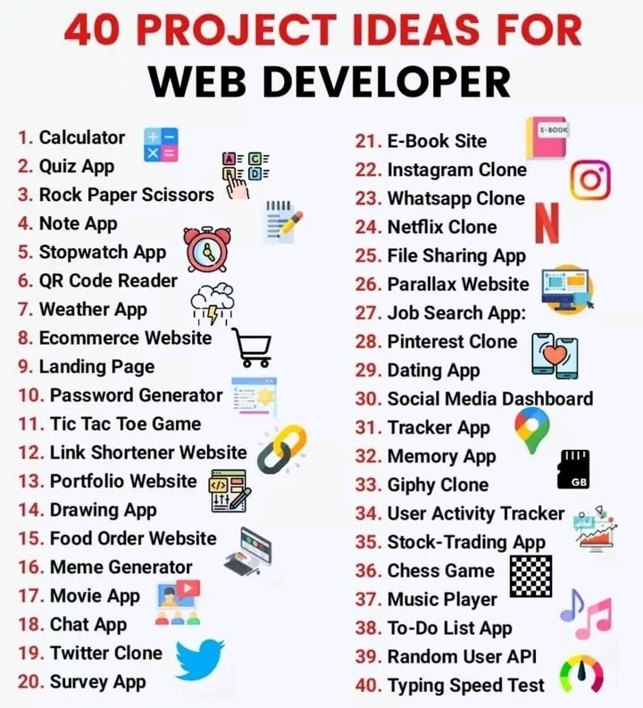

# 40 projets de développment web

Ce projet est une collection de 40 projets de developpement web réalisés en HTML, CSS, JavaScript comme langages et comme pour framworks React, NextJS et bien plus encore.
Ces projets vont du plus simple au plus complexes.

### Voici la liste des projets en questions:

## Lien vers les 40 Projets:

- ### Project 1 - Calculator App:
  - #### Description:
    Il s'agit d'une calculatrice simple et entièrement fonctionnelle construite à l'aide de HTML, CSS et JavaScript. Elle permet d'effectuer des opérations arithmétiques de base comme l'addition, la soustraction, la multiplication et la division.
  - #### Stack:
    HTML, CSS, JavaScript
  - #### Lien:
    [Project 1 - Calculator App:](https://github.com/OumarouSandaSouley/Project-1-Calculator-App)
- ### Project 2 - Quiz Sportif en JavaScript:
  - #### Description:
    Il s'agit d'une application de quiz sportif interactive construite à l'aide de HTML, CSS et JavaScript. Elle couvre plusieurs sports comme le football, le basketball, l'athlétisme et le volleyball, permettant aux utilisateurs de tester leurs connaissances.
  - #### Stack:
    HTML, CSS, JavaScript
  - #### Lien:
    [Project 2 - Quiz Sportif en JavaScript:](https://github.com/OumarouSandaSouley/Project-2---Quizz-App)
- ### Project 3 - Jeu du Pierre, Papier, Ciseaux en JavaScript:
  - #### Description:
    Il s'agit d'une implémentation du jeu classique Pierre, Papier, Ciseaux en JavaScript avec le fonctionnment et les régles connues. Vous jouez contre le PC.
  - #### Stack:
    HTML, CSS, JavaScript
  - #### Lien:
    [Project 3 - Jeu du Pierre, Papier, Ciseaux en JavaScript:](https://github.com/OumarouSandaSouley/Project-3-Rock-Paper-Cisor)
- ### Project 4 - Application de prise de notes en JavaScript:
  - #### Description:
    Il s'agit d'une application web responsive design de prise de notes faite avec du JavaScript.
  - #### Stack:
    HTML, CSS, JavaScript
  - #### Lien:
    [Project 4 - Application de prise de notes en JavaScript:](https://github.com/OumarouSandaSouley/Project-4-Notes-App)
- ### Project 5 - Chronomètre Numérique en JavaScript:
  - #### Description:

    Il s'agit d'une application web de chronomètre numérique responsive faite avec du JavaScript.
    - #### Stack:
    HTML, CSS, JavaScript 
    - #### Lien:
    [Project 5 - Chronomètre Numérique en JavaScript](https://github.com/OumarouSandaSouley/Project-5-Stop-Watch)
- ### Project 6 - Lecteur de code QR en JavaScript:
  - #### Description:

    Il s'agit d'un lecteur de code QR qui vous permet de scanner et de décrypter le contenu d'un code QR responsive faite avec du JavaScript.
    - #### Stack:
    HTML, CSS, JavaScript 
    - #### Lien:
    [Project 6 - Lecteur de code QR en JavaScript](https://github.com/OumarouSandaSouley/Project-6-QR-Code-Reader)
- ### Project 7 - Application de Méteo en JavaScript:
  - #### Description:

    Il s'agit d'une application web de méteo en JS. Elle affiche la méteo courante, la description l'humidité, la pression, la vitesse du vents etc....
    - #### Stack:
    HTML, CSS, JavaScript, OpenWeather Map API
    - #### Lien:
    [Project 7 - Application de Méteo en JavaScript](https://github.com/OumarouSandaSouley/Project-7-Weather-App)
- ### Project 9 - Landing Page:
  - #### Description:

    Il s'agit d'une simple d'une landing page basé sur une publication du Dr. Docteur Noubissie parlant la Claudel Noubissie Business Group. Cette page présente la Claudel Noubissie Business Group avec la publication du docteur "APPRENEZ À VENDRE, LAISSEZ LE JAMBO !"
    - #### Stack:
    HTML, CSS, JavaScript, reactjs and Tailwind CSS
    - #### Lien:
    [Project 9 - Landing Page](https://github.com/OumarouSandaSouley/Project-9-Landing-Page)
- ### Project 10 - Génerateur de mot de passe securisé en JavaScript:
  - #### Description:

    Il s'agit d'un génerateur de mot de passe securisé en JavScript. Vous avez la possibilité de choisir les caractères que vous voulez notttament les lettres, les chiffres, les caractères spéciaux et d'inclure la majuscule ou pas en enfin de choisir la longeur de votre mot de passe.
    - #### Stack:
    HTML, CSS, JavaScript.
    - #### Lien:
    [Projet 10 - Génerateur de mot de passe securisé en JavaScript](https://github.com/OumarouSandaSouley/Project-10-Password-Generator)
- ### Project 11 - Jeu du Tic Tac Toe en JavaScript:
  - #### Description:

   Il s'agit d'une implémentation du jeu classique Tic Tac Toe en JavaScript avec le fonctionnment et les régles connues. Vous jouez contre le PC.
    - #### Stack:
    HTML, CSS, JavaScript.
    - #### Lien:
    [Project 11 - Jeu du Tic Tac Toe en JavaScript](https://github.com/OumarouSandaSouley/Project-11-Tic-Tac-Toe-Game-)
- ### Project 12 - Raccourcisseur d'URL en JavaScript:
  - #### Description:

   Il s'agit d'une implémentation d'un racourcisseur d'URL en JavaScript.
    - #### Stack:
    HTML, CSS, JavaScript.
    - #### Lien:
    [Project 12 - Raccourcisseur d'URL en JavaScript](https://github.com/OumarouSandaSouley/Project-12-Link-Shortener)
- ### Project 13 - Portfolio website:
  - #### Description:

   Il s'agit de mon propre portfolio sous forme de livre. Il présente mes activités, mes stats GitHub et ainsi que mes projets réalisés dans un cadre de design clair et élegant.
    - #### Stack:
    HTML, CSS, JavaScript, ReactJS, Tailwind CSS, React Flip Page
    - #### Lien:
    [Project 13 - Portfolio website](https://github.com/OumarouSandaSouley/Project-13-Portfolio-Website)
- ### Project 14 - Application de dessin en JavaScript:
  - #### Description:

   DrawMe est une application de dessin amusante et gratuite qui permet aux utilisateurs de créer des dessins en utilisant différents outils et formes.
    - #### Stack:
    HTML, CSS, JavaScript
    - #### Lien:
    [Project 14 - Application de dessin en JavaScript](https://github.com/OumarouSandaSouley/Project-14-Drawing-App)
